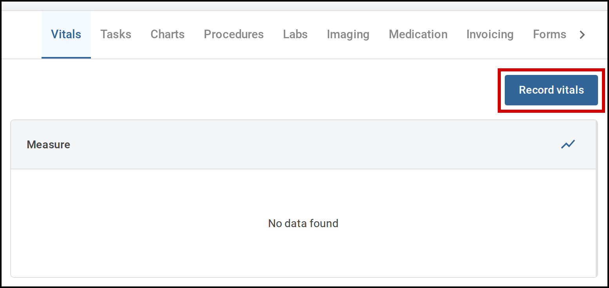
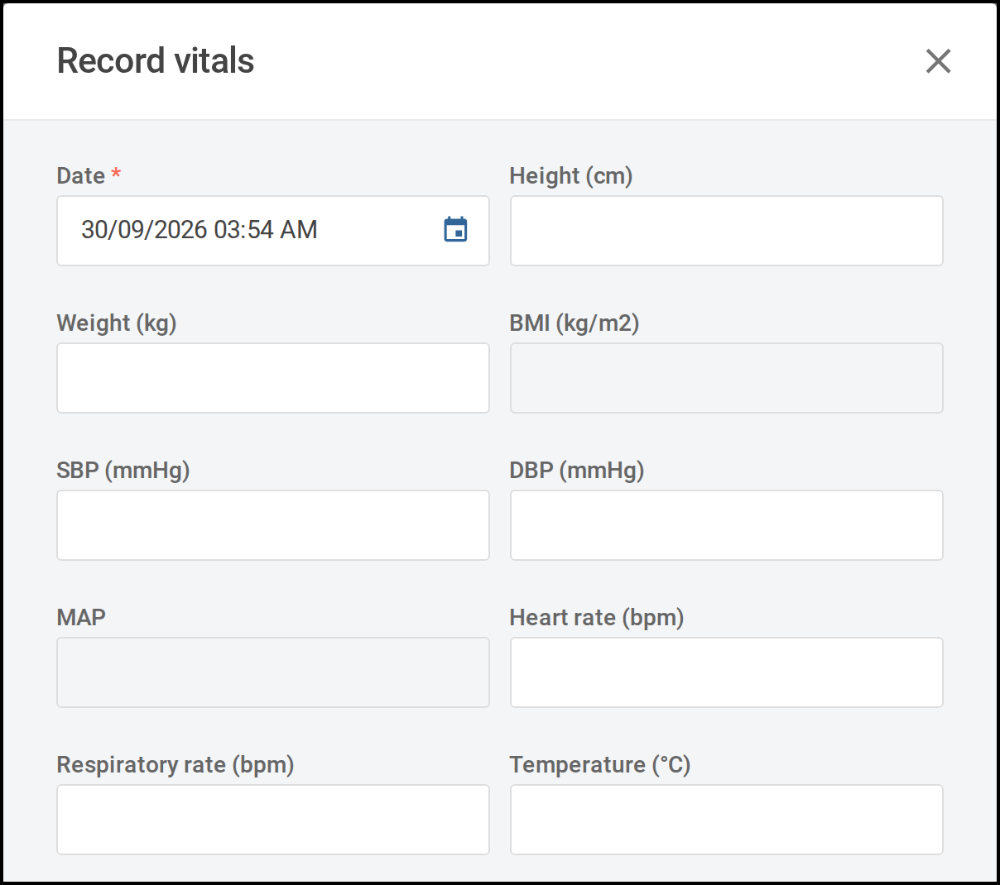
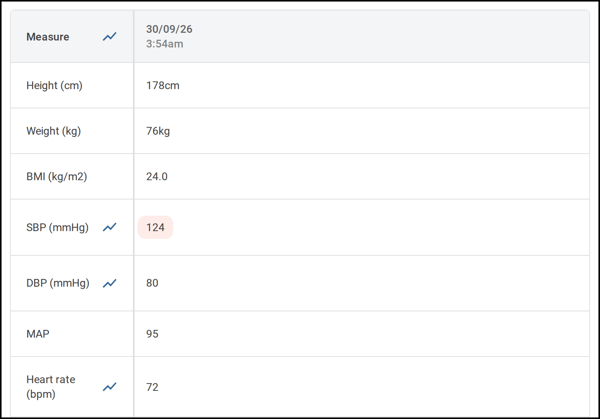

[← Vitals](README.md)

# 10.1 Record a set of vitals

Record a patient's observations against the encounter they are admitted under. Start from
the patient's encounter.

   
  Select <b>Record vitals</b> on the encounter's <b>Vitals</b> tab.

## Steps

1. Open the **Vitals** tab.

   The table lists every set of vitals already recorded for this encounter. If none have
   been recorded yet, it shows **No data found**.

2. Select **Record vitals**.

   The **Record vitals** window opens.

   

      
     The <b>Record vitals</b> window opens with the date and time filled in.
   

3. Check the date and time at the top of the form.

   They are filled in with the current date and time. Change them if the observations were
   taken earlier.

4. Enter the measurements you have taken.

   Fill in only the fields you have readings for and leave the rest blank. You need at
   least one reading to record. Some fields work themselves out from other measurements
   and cannot be typed into.

5. Select **Record**.

   The window closes and your readings appear as a new column at the left of the table.
   The most recent set of vitals is always the first column.

   A reading outside the normal range for the patient's age is highlighted. Rest your
   pointer on it to see the normal range.

   

      
     Your new reading appears as the first column of the table.
   

