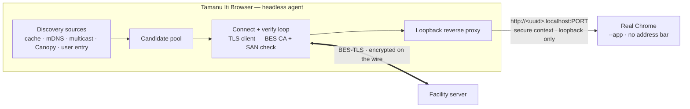

# Tamanu Iti Browser — design

Status: **design / not yet built**. This document describes the shape of the
**Tamanu Iti Browser**, a thin native client (the shell) that lets clinical
staff reach a facility server on networks where public DNS and publicly-trusted
HTTPS are not available. It is a design artifact to be reviewed before any
package is scaffolded.

## Name

**Tamanu Iti** (*iti* = "little") is an existing BES product: a small Tamanu
facility-server appliance built for low-IT settings — exactly the environments
this client targets. The client is a **separate** thing and is named the
**Tamanu Iti Browser** to keep it distinct from the appliance: the appliance is
the server hardware, the Tamanu Iti Browser is the client that talks to it (and
to other facility servers in the same low-IT model). The name also disambiguates
the client from a plain browser: "use the **Tamanu Iti Browser** instead of
Chrome". Throughout this document "Tamanu Iti Browser" and "the shell" are used
interchangeably; "Tamanu Iti" on its own refers to the appliance.

## Background

In production, Tamanu is **just a website**: a single HTTPS origin that serves
the facility web app. On normal networks staff reach it over a public name with
a publicly-trusted certificate — DNS resolves, TLS is trusted, secure-context
APIs work, and the site can be installed as a PWA. All a client needs is an
up-to-date Chromium.

The shell treats that website as **opaque**: a URL that serves a website over
HTTPS. It must not depend on how the site is built, bundled, or served (Vite,
Caddy, static vs. dynamic, and so on are all irrelevant to it). From the shell's
perspective there is one thing — an origin — and its job is to reach that origin
and point a browser at it.

Some facilities cannot obtain publicly-trusted certificates and run on ad-hoc
LANs with no static addressing. On those networks:

- Access is over HTTP by IP (or mDNS `.local`, where the network allows it).
- The facility server's IP churns as DHCP leases renew.
- HTTP loses the browser's secure context, so a range of web APIs silently
  break, and traffic is unencrypted on the LAN.
- The installed-PWA experience hides the address bar, so when the IP changes
  the user cannot re-point it and has to fall back to a raw browser.

The server-side answer (a BES-run private CA, per-facility certificates renewed
against Canopy while the server has intermittent internet, served by Caddy) is
**out of scope for this document and already in progress**. What remains, and
what this document covers, is the **client**: a distributable native shell that
discovers the facility server, connects to it over a certificate that chains to
the BES CA, and loads the facility website against a stable, trusted, secure
origin.

## Goals

- Reach a facility server whose address is unknown and changing, with **no
  reliance on public DNS or publicly-trusted certificates**.
- Present the connection as a **secure context** so the website behaves exactly
  as it does on a normal deployment, with no change to Tamanu itself.
- Keep the address churn **invisible** to the user, and preserve web storage
  and session across it.
- Be **installable fully offline** — a single file copied over a LAN or a USB
  stick, no internet required to stand up a new client.
- Support an **unattended kiosk / TV display** configuration on Android (e.g. an
  ED triage board), running hands-off and always-on.
- Stay a **thin, near-static shell**: all product logic remains in the website,
  so the "one website everywhere" model is preserved and the shell rarely needs
  updating.

## Non-goals

- No product UI in the shell. It discovers, establishes a trusted origin, and
  loads the website. Nothing else.
- No coupling to how Tamanu is built or served. The shell targets an origin, not
  a bundle; it works unchanged whatever Tamanu's build looks like.
- No server-side work (CA, ACME-style renewal, Caddy config, Canopy
  registration). Those are separate and already underway.
- iOS is **deferred**. Android tablets are the primary mobile target; desktop
  (Windows/macOS/Linux) is the primary workstation target.
- **No clock-skew handling.** By design the shell does nothing about device
  clocks (see Trust model for why it cannot affect us).
- **Not a universal client.** The shell targets the local / no-PKI case; a
  normally publicly-trusted deployment is served by the plain website / PWA as
  today. The facility record is kept extensible so a public-URL facility *could*
  be added later, but that pathway is not built in v1 (see Decisions).

## Trust model (assumed from server-side work)

The shell is built around these properties, which the server side provides:

- A **BES-run CA** (long-lived, e.g. 10 years; ideally an offline root plus a
  signing intermediate) whose anchor is **baked into the shell binary**.
- Each facility server holds a **BES-signed leaf certificate** whose SAN is a
  **stable identity** (e.g. the facility/server UUID as a name under a reserved
  namespace such as `.internal`), **not** an IP. The server keeps that leaf
  comfortably long-lived (six-month validity, renewed against Canopy at 90 days
  of remaining life), with the `notBefore` date **backdated ~48 hours** at
  issuance.

Consequences the shell relies on:

- Trust does **not** require the client to be online — the anchor ships in the
  binary.
- The certificate is bound to a stable name, so **IP churn never invalidates
  it**.
- Verifying "chains to BES CA" **and** "SAN == the facility I asked for" answers
  both *authentic server* and *correct server* cryptographically. This is what
  makes broad, promiscuous discovery safe (below).
- **Clock skew cannot affect trust**, so the shell handles none. Within the
  six-month / renew-at-90-day window the only exposure is at the very edges:
  the `notBefore` backdate covers a device clock that runs behind just after a
  renewal, and the far edge only bites a facility that has been offline for
  ~two months, which is a "fix the facility or drop to plain HTTP" situation,
  not a case to engineer around. Application-level skew remains Tamanu's own
  concern.

## Versioning and compatibility

The shell has its **own version line**, independent of Tamanu's. It may be
released *alongside* Tamanu's artifacts for convenience, but must never be named
or numbered to match a Tamanu version — that would train clients to believe the
shell must be kept in lockstep with the server, when in fact there is broad
compatibility. The aim is that **an old shell keeps working against all Tamanu
versions**, so that we ship the shell approximately once and rarely again.

That guarantee holds only if the shell's contract with the server stays tiny and
stable. The shell's **entire protocol surface** is:

- an HTTPS **origin** that serves a website (opaque — see Background),
- a **BES-signed certificate** whose SAN is the facility identity, and
- a **discovery record** describing where that origin currently lives.

The shell knows nothing of Tamanu's application-level APIs or versions. Keep the
discovery record and any negotiation **add-only** (versioned, with new fields
optional and ignored by older shells), so the protocol never breaks
backwards-compatibility and the server side can evolve freely.

Fixing the **exact** minimum contract that gets frozen is a *closing* step of
the build, not an upfront decision: once discovery, trust, origin scheme, and
the picker are actually implemented, one of the last tasks is to write down the
minimal, add-only surface those settled on and commit to never breaking it. It
is called out here so it is not forgotten, but it is deliberately deferred to
the end.

## Renderer and security ownership

The single biggest risk to "ship once, never again" is the **web renderer**.
Chromium ships security fixes every few weeks, often for actively-exploited
zero-days. Whoever bundles the renderer owns that patch treadmill.

A core advantage of the plain-website model is that **browser security is the
vendor's problem, not Tamanu's** — the user's auto-updating Chrome is patched by
Google. The shell must not casually give that up. If it bundled its own Chromium
(e.g. Electron), Tamanu would own renderer security, which on these offline
networks means either running auto-update infrastructure that cannot reliably
reach the clients, or a **frozen, unpatched browser handling patient data**. That
is the worst outcome and it defeats the ship-once goal.

Therefore the design principle is: **the shell should host no renderer of its
own, and keep renderer security delegated to the platform/browser vendor.** This
also keeps the shell tiny and its attack surface small, which is what makes the
"rarely shipped, never on a security clock" goal realistic. Because the primary
path is the plain website and this is a fallback, we should not materially
compromise security to build it.

The runtime options, ranked by how well they preserve delegated patching:

1. **Headless helper + the user's real Chrome (preferred for desktop).** The
   shell is a small headless agent with **no renderer**. It does discovery,
   holds the BES anchor, and runs a **loopback reverse proxy**: its own TLS
   client verifies the facility certificate against the BES CA (pinning as
   ordinary code — no browser trust hook needed), then exposes the connection to
   the browser as `http://<facility-uuid>.localhost:PORT` and launches the
   already-installed Chrome at that URL.
   - `http://*.localhost` is a **secure context** by spec, so every gated web API
     works with no certificate juggling in the browser.
   - The renderer is the user's **real, Google-patched Chrome** — security stays
     delegated.
   - On-the-wire encryption is intact (agent→facility is BES-TLS); only the
     loopback hop is plaintext and never leaves the machine.
   - Chrome's `--app=http://…` flag opens a standalone, address-bar-less window,
     recreating the seamless PWA-like experience.
   - A stable `<uuid>.localhost` origin on a persisted port preserves session and
     web storage across IP churn.
2. **System-webview wrapper (fallback).** A Tauri-style shell over the system
   webview — WebView2 (Chromium, Microsoft-patched) on Windows, WKWebView on
   macOS, WebKitGTK on Linux. Vendor-patched, so ship-once survives, but on
   macOS/Linux the WebKit engine reintroduces the cross-engine drift Tamanu
   escaped by standardising on Chrome. Acceptable fallback, not first choice.
3. **Bundled Chromium (last resort).** Electron and similar. The only option
   that forces Tamanu to own renderer security and so defeats ship-once; avoid
   unless the above cannot be made to work.

**Android uses the embedded system WebView — one path, no Chrome Custom Tabs.**
The WebView is Chromium, patched by Google via Play, so delegated patching is
preserved without an external browser. Custom Tabs were the alternative for the
interactive case, but the kiosk / TV display configuration needs the embedded
WebView anyway, so supporting Custom Tabs as well would mean two rendering paths
for no benefit. The shell loads the site into its own WebView (with the loopback
origin providing the secure context, as on desktop); the only Android-specific
work is enabling DOM storage and configuring the WebView (see Web storage and
the kiosk section).

## Architecture overview

The preferred desktop shape — a headless agent that proxies to the user's real
Chrome over loopback (see Renderer and security ownership):



The trust decision is made by the agent's own TLS client in ordinary code, so no
browser certificate hook is required. On a system-webview or Custom-Tab variant
the same core is reused; only the final hop (loopback origin vs. an in-process
webview) differs.

Shared, runtime-agnostic logic (candidate modelling, the connect/verify state
machine, cache format, the TLS-verification and origin-mapping contract) should
live in a small TypeScript core, so desktop and mobile differ only at the
platform boundary (discovery transports and how the verified connection is
surfaced to a browser).

## Launch → loaded flow

The shell is a small state machine. From cold launch to a loaded website:

1. **Resolve target facility (multi-facility picker).** Several facilities
   (e.g. different departments) can share one LAN, and discovery — the Canopy
   pathway especially — may surface more than one without knowing which the user
   wants, so a picker is a **core feature**, not a single-vs-multi install
   toggle:
   - If a facility is already chosen for this context — remembered from last time,
     or pinned at kiosk setup — use it and skip the picker.
   - Otherwise enumerate the facilities the shell knows about (cached known
     facilities plus any surfaced by discovery/Canopy) and present a picker.
     Each is a **stable identity**, never an address; the picker works offline
     from the cache. Remember the choice so it is not asked again.

2. **Generate candidates** for the chosen facility (see the candidate stack).
   This is a *broad* set of `(address, port)` guesses from every available
   source, deduplicated, ordered best-first (last-known-good on this network
   first). Discovery may surface addresses for several facilities at once;
   candidates are filtered to the chosen identity (and confirmed by the SAN check
   at step 3), so co-located facilities never cross over.

3. **Connect + verify loop.** For each candidate, in order and with bounded
   concurrency, attempt a TLS connection and **verify** it (in the agent's own
   TLS client — no browser hook needed):
   - certificate must chain to the baked-in BES CA, **and**
   - the SAN must equal the target facility identity.
   The first candidate that passes is the server. Everything else — wrong IP,
   stale entry, another facility, an impostor — fails the handshake and is
   discarded. No candidate source needs to be trusted; the certificate is the
   filter.

4. **Bind the stable local origin.** In the preferred model the agent exposes
   the verified tunnel as a stable loopback origin — `http://<facility-uuid>.
   localhost:PORT` (a secure context; persisted port so the origin is constant
   across launches). The winning IP for this session lives only inside the
   agent's upstream TLS client; the browser only ever sees the constant
   localhost origin, regardless of the underlying IP. (A system-webview variant
   binds an equivalent stable origin in-process.)

5. **Launch the browser** at that origin and hand off — real Chrome via
   `--app=http://…` for an address-bar-less window in the preferred model, or an
   in-process webview in the fallback. The shell now only supervises the
   connection.

6. **On connection loss / IP change**, re-run steps 2–3 in the background and
   re-point the tunnel's upstream, keeping the local origin constant. Because
   the browser-facing origin does not change, the site's `localStorage` /
   `IndexedDB` / session survive the reconnect — the user is not logged out and
   the cache is not dropped. Surface a small "reconnecting" state only if it
   takes long enough to matter.

7. **On successful connect**, write the winning `(network fingerprint → address)`
   to the last-known-good cache so the next launch on this network starts there.

Manual entry (below) can inject a candidate at step 2 at any time; it flows
through the same verify loop, so a typed or scanned address is validated
cryptographically, never trusted because a human entered it.

## Candidate discovery stack

Discovery only has to be **broad**; trust does the filtering. Sources, merged
into one pool and tried best-first:

| Source | Transport | Covers | Notes |
|--------|-----------|--------|-------|
| Last-known-good cache | — | Repeat visits on a known network | Keyed by network fingerprint (SSID / gateway MAC / subnet). Tried first. |
| mDNS / DNS-SD | Multicast (v4+v6) | Standard LANs | Use it, don't depend on it: some appliances drop 5353, some mirror it across subnets. |
| Custom UDP multicast | Multicast (v4+v6) | LANs where mDNS specifically is filtered | **IPv6 has no broadcast — multicast is the portable mechanism.** Own group/port; a modernised version of Tamanu's old broadcast ping. |
| Canopy candidate list | HTTPS (cached) | Cross-subnet, multicast-blocked | Server reports its own interface addresses to Canopy while online; client caches the list and tries them all. Only available if fetched during a prior online moment. |
| User entry | — | Zero-infrastructure backstop | Typed address, or **QR scan** (facility console / Canopy shows a QR of identity + candidate addresses) — the ergonomic form on tablets. Once it works, it seeds the last-known-good cache, so entry is once-per-network, not per-session. |

**No active scanning.** The shell deliberately does not sweep or port-scan the
subnet to find the server. Unsolicited connection attempts across a LAN are the
behaviour of malware and are rightly flagged by sysadmins and endpoint security;
we will not ship it. The user-entry backstop (typed or QR-scanned) covers the
case where every passive/announced source fails, without the shell ever probing
hosts it was not told about.

Design implications:

- The discovery core exposes candidates as a **stream** so the connect loop can
  start trying fast sources (cache, entry) immediately while slower sources
  (multicast responses) trickle in.
- A candidate is just `{ address, port, source }`. Sources are pluggable so the
  two shells can supply platform-native transports (Android NSD vs a desktop
  mDNS library) behind one interface.

## Where the advertisement runs (host side)

The candidate stack above is the *client's* view. On the facility side, the
announcement (mDNS/multicast responder, host-interface enumeration, Canopy
candidate reporting) runs in a **host-level component, not the Tamanu server
process** — specifically bestool's **`alertd` daemon, which is already installed
on every Tamanu host**, so this is a new capability on an existing daemon rather
than a new thing to deploy.

**Why host-level, not in the server.** Answering LAN multicast and enumerating
the host's real LAN addresses are host-networking concerns. An in-process
responder works on today's bare-metal Windows servers but breaks on the
container topologies — Linux/Kubernetes now, Windows containers on the roadmap:
a bridged container doesn't emit/receive LAN multicast without host networking, a
K8s pod effectively can't, and the addresses visible inside a container are
NAT/pod IPs, not the LAN IP a client needs. A host daemon is topology-invariant:
it binds the node's LAN interface and reaches the (possibly containerised) server
over its published port like any other local client.

**What `alertd` does:** runs the mDNS/DNS-SD and custom UDP multicast responders,
enumerates the host's real LAN addresses, reports the candidate address list to
Canopy (the only vantage point that sees the true host IPs), and advertises only
while the server is healthy and advertising is enabled.

**What Tamanu exposes — one tiny loopback endpoint.** Tamanu (behind Caddy)
serves a read-only `GET /_discovery` on loopback:

```json
{ "facilityId": "<uuid>", "displayName": "...", "port": 443,
  "healthy": true, "advertise": true, "protocolVersion": 1 }
```

`alertd` queries `127.0.0.1:<published-port>/_discovery` to learn what to
advertise and whether to. It is deliberately minimal and **non-sensitive**
(identity + reachability + health — no PHI, no secret), so it needs no auth on
loopback; it survives containerisation unchanged (host → published port →
container, the same path any client takes); and it decouples `alertd` from
Tamanu's config format.

**Enable toggle.** Whether to advertise on the LAN is a **facility setting**
(admin-panel controlled, per the settings-not-config principle), surfaced through
`/_discovery` as `advertise`. Normal cloud deployments leave it off; Iti /
low-IT deployments turn it on. `alertd` advertises only when `healthy &&
advertise`. The advertised wire payload (facility id + port + protocol version)
is the same frozen, add-only contract the browser consumes (see Versioning).

## Trust enforcement

The requirement: the facility connection must chain to the BES CA (and reject a
publicly-trusted certificate presented for it), while everything else the site
loads keeps using the normal system trust store so external resources still
work. Crucially, this must **not** be done by adding the BES CA to a global
trust store — that would let a public certificate satisfy the facility
connection.

**Preferred model (headless helper): trust is enforced in the agent's own TLS
client, in ordinary code.** The agent is the only thing that speaks TLS to the
facility; it verifies "chains to baked-in BES CA **and** SAN == target facility
identity" itself, with a trust store scoped to *just* the BES anchor for that
connection. The browser never participates in this trust decision — it only ever
talks to `http://<uuid>.localhost`, a secure context needing no certificate at
all. External resources the site loads go straight from the browser over its
normal trust store, untouched. This is cleaner than any browser hook: pinning is
plain client code, and there is no global-store pollution because the BES anchor
never enters the browser's store.

**In-process-webview variants** (system webview / Electron fallbacks) don't have
a separate TLS client, so they need a **per-origin** browser trust hook instead:

- **Electron:** `session.setCertificateVerifyProc` — for the facility origin,
  require chain-to-BES-CA and SAN match, else reject; for every other origin,
  return the "use Chromium default" code so public CAs still work.
- **Android WebView:** declarative via `network_security_config.xml` — a
  `<domain-config>` for the facility host whose `<trust-anchors>` are the bundled
  BES CA, the rest inheriting system trust; enforce the SAN check in code.
- **iOS (deferred):** the `WKNavigationDelegate` `didReceive challenge` delegate
  does per-host custom trust evaluation.

Either way, the property to hold is the same: BES-CA-only for the facility,
system trust for everything else.

Defence-in-depth: putting the facility identity under a reserved namespace
(`.internal`) means no public CA can issue for that name at all, so even a
misconfigured global store cannot be satisfied by a public certificate for it.
Treat this as a backstop, not the primary control.

## Web storage, sessions, and login persistence

Ordinary web storage (localStorage, sessionStorage, IndexedDB, cookies) must
work and persist exactly as on a normal deployment. The site already builds
"remember me", last-route restore, and offline caching on top of it; the shell
must not get in the way. Because storage is partitioned by **origin**
(scheme + host + port), getting the origin right is the whole of this problem.

Two properties are required:

1. **Stable origin → persistent storage.** The browser-facing origin must be
   deterministic and constant across launches (and across IP churn), and the
   storage must live in a **persistent** profile / data dir — never an ephemeral
   one recreated per launch. Given that, the site's existing behaviour carries
   through with no new shell logic:
   - "Remember me" on → token in localStorage → survives a shell restart (wanted
     for a kiosk / triage board).
   - "Remember me" off → token in sessionStorage → cleared when the shell window
     closes → logged out on restart (wanted on a shared workstation).
   - Return-to-page after login is the site restoring its last route from
     storage; the shell only has to keep the origin stable (and may launch at a
     configured deep link for a kiosk board).

2. **Per-facility isolation.** Encode the facility identity in the origin's
   **host** — `http://<facility-identity>.localhost:PORT` — so each facility is a
   distinct origin with its own isolated storage. Never one shared storage area
   across facilities, and never a random or rotating origin (which would silently
   orphan storage and log users out).

Notes and gotchas:

- **`.localhost`, not `.local`.** `*.localhost` is reserved, resolves to
  loopback, and is a secure context — exactly what the loopback proxy needs.
  `.local` is the mDNS/Bonjour LAN namespace: it names other hosts on the
  network, is not loopback, and would not be a secure context. Do not conflate
  them; `.local` belongs only to the discovery side, if anywhere.
- **Persist the port per facility** as well as the host — the port is part of the
  origin, so a changing port would orphan storage just like a changing host.
- **Validate `*.localhost` subdomain resolution** in each renderer (Chrome
  resolves it to loopback; confirm Android WebView). If a renderer only resolves
  bare `localhost`, fall back to `127.0.0.1` with a **stable per-facility port** —
  partitioning then rides on the port, which still gives each facility its own
  storage.
- **Android WebView disables DOM storage by default** — it must be explicitly
  enabled and cookies set to persist, or the site's storage silently fails.
- **Desktop `--app` Chrome:** decide between the user's default profile (shares
  storage with their normal browsing) and a dedicated persistent
  `--user-data-dir` (isolated and predictable). Either persists storage; a
  dedicated dir is the cleaner isolation.

## Android kiosk / TV display mode

The Android shell must support an **unattended, always-on display**
configuration — e.g. an ED triage board mounted in the department. This is a
supported use case, not an afterthought; the design must not break it.

The connection core is unchanged (discovery, BES-cert trust, and the loopback
`http://<uuid>.localhost` secure context all work inside a WebView). What the
kiosk configuration adds:

- **Embedded WebView, not Custom Tabs.** A permanent display needs no browser UI
  and must not be navigable away from the board. Custom Tabs aren't built for
  this, and Android TV devices often don't ship Chrome at all — so the kiosk path
  loads the site into the app's own fullscreen system WebView (immersive mode,
  lock-task/kiosk pinning). The WebView is still vendor-patched, so this doesn't
  re-insource renderer security.
- **Hands-off operation.** There is no operator at the display, so nothing may
  depend on runtime user entry. "Which facility + where to start" is provisioned
  **once at setup** (a QR scan or config is fine there) and **persisted**;
  runtime discovery relies only on cache + mDNS/multicast + Canopy. Auto-reconnect
  on IP churn (already in the launch flow) is what keeps the board live.
- **Survives the environment.** Auto-start on boot (`BOOT_COMPLETED`),
  keep-screen-awake, and auto-relaunch on crash, so a power blip or reboot brings
  the board back with no human present.
- **Android TV caveat.** Confirm the target hardware — a wall-mounted tablet/box
  vs. an actual Android TV (leanback, D-pad, no touch, frequently no Chrome).
  A display-only board needs little input, but WebView availability and the
  launcher/auto-start story differ between the two and should be validated on the
  real device.

## Packaging and release

Builds follow the existing `cd-package-*` pattern (build in CI, attach to the
release, upload artifacts to S3), but the Tamanu Iti Browser carries its **own
version**, not Tamanu's (see Versioning and compatibility) — releasing alongside
Tamanu is a convenience, not a coupling. The monorepo package working name is
`packages/tamanu-iti-browser` (`@tamanu/iti-browser`), with the Android app as a
sibling build (Gradle) sharing the TypeScript core but not the desktop build
path — plan it as its own CI job.

### Cross-cutting principles

These shape every per-platform choice below:

- **The headless-agent model makes desktop packaging light.** Because desktop
  bundles no Chromium (it launches the user's installed Chrome — see Renderer and
  security ownership), the artifact is a **small native binary**, not a
  hundreds-of-MB Electron installer. Packaging is closer to shipping a CLI tool
  than a browser.
- **Offline-installable channel is mandatory on every platform.** A core goal is
  standing up a client with no internet, so each platform must have at least one
  channel that needs **no store and no network** — a copyable file (direct APK,
  AppImage, portable `.exe`, `.dmg`) or a raw installer hosted on the release.
  Stores and package managers are **additive conveniences layered on top**, never
  the only way in.
- **Code signing is a distribution concern, deferred past validation — not a
  build prerequisite.** Build and prove the client with **unsigned** artifacts
  first; they install fine through the warnings (Windows SmartScreen "more info →
  run anyway", macOS Gatekeeper right-click-open, Android "install unknown app"),
  which is perfectly acceptable while validating that the approach solves the
  problem. (Android needs no procurement at all — an APK must be signed with
  *some* key to install, and we **already have an Android signing key** from the
  existing mobile pipeline, so validation and production builds can both use it.)
  Only when standing up *real* distribution on desktop, where per-install
  warnings are unacceptable at scale, add the desktop signing: an Authenticode
  cert (Windows; EV to bypass SmartScreen immediately) and an Apple Developer ID
  + notarisation (macOS; ~$99/yr program), wired into CI like
  `cd-package-frontend.yml` handles signing certs. Keeping it a later step means
  cert procurement never blocks proving the design.
- **Sandboxed/store formats fight our model.** The agent must bind a **loopback
  port** and **launch the user's real Chrome**. Confined formats — Snap, Flatpak,
  macOS App Store, Windows MSIX/Store — all constrain exactly those two things
  and need extra entitlements/portals or simply can't. This is the recurring
  reason store formats are optional-at-best rather than primary.
- **Decoupled versioning frees us from store latency.** Because the client's
  version is independent of Tamanu's, store review time never blocks a Tamanu
  release, and stores (which don't care about the Tamanu version) are happy with
  our own cadence and signing keys.

### Android

- **Direct APK (primary, required).** Sideloadable, copyable over LAN/USB, no
  Google dependency — the only channel that satisfies offline install. Hosted on
  the release / S3 like other artifacts. Needs "install unknown apps" allowed, or
  push via MDM.
- **Managed Play / MDM (fleet & kiosk).** For Android Enterprise fleets, push the
  APK (or a Managed Google Play private app) to devices; this is also the clean
  way to provision kiosk lock-task and auto-start. The right path where an
  MDM exists.
- **Google Play Store (optional convenience).** Trade-off: eases install and
  gives auto-update and store trust, but requires internet + Play Services (often
  absent on AOSP tablets, kiosk boxes, and many Android TV devices), adds policy
  overhead (target-API, privacy declarations, review latency), and **cannot serve
  the offline case** — so it is strictly additive, never the sole channel. Our
  decoupled versioning is fine for Play (it doesn't care about the Tamanu
  version).

### Windows (primary target)

First, correct a common assumption: in the preferred model the Windows
dependency is **"Chrome is installed"** (already the deployment premise), *not*
WebView2. WebView2 (the Microsoft-patched, evergreen system webview, present by
default on Windows 11) only matters if we fall back to the system-webview
wrapper.

- **Signed portable `.exe` (primary, offline).** A single self-contained agent
  binary that runs with no install — copyable to a workstation, matches the
  offline ethos, no admin rights needed. Great for quick and ad-hoc use.
- **Signed MSI (primary, fleet).** For managed workstations: silent install
  (`msiexec /qn`), deployable via Intune / SCCM / GPO, proper install/uninstall
  and autostart registration. This is the "install on every workstation through
  fleet management" path. Cost: MSI authoring is fiddly (WiX or similar), and it
  must be Authenticode-signed or SmartScreen scares users off.
- **Winget (optional, later).** Now built into Windows and no longer purely
  developer-facing; a manifest pointing at the signed installer gives
  `winget install`. Additive convenience for semi-managed setups; large fleets
  still use MSI + Intune/SCCM.
- **Skip Microsoft Store (MSIX) and Chocolatey.** MSIX's containerisation fights
  the loopback + launch-Chrome model and adds Store policy/review for little gain
  on a fallback utility; Chocolatey is developer-audience. Neither earns its keep
  here.

### macOS

macOS is likely rare on these low-IT sites but matters for roaming clinician
laptops.

- **Notarised `.dmg` (primary).** The standard "drag to Applications" bundle.
  **Signing with an Apple Developer ID and notarising is mandatory** — without it
  Gatekeeper refuses to open the app on modern macOS, and the bypass is
  increasingly hard. This is a hard prerequisite (Developer Program membership +
  CI notarisation), not optional polish.
- **Signed `.pkg` (fleet).** A notarised installer package installs silently and
  is pushable via MDM (Jamf, Intune) — the macOS equivalent of the MSI path.
- **Homebrew cask (optional).** `brew install --cask` from a BES tap: convenient
  and scriptable for Mac-comfortable admins, but a developer-leaning audience and
  needs Homebrew + internet. Nice-to-have, not primary.
- **Skip the Mac App Store.** Its mandatory sandbox fights launching the user's
  Chrome and the loopback listener; entitlements are unlikely to clear review for
  a utility whose whole job is to drive another browser.

### Linux

The small-binary agent packages much more easily than a typical Linux desktop
app, but there is no single universal format:

- **AppImage (primary).** One self-contained file, no install, runs across
  distros — a near-perfect fit for the offline, copyable ethos. Trade-offs: no
  system integration (autostart for a Linux display needs a hand-added `.desktop`
  / user systemd unit), a FUSE dependency on minimal systems, and no built-in
  auto-update (fine, given ship-once).
- **`.deb` (Ubuntu/Debian fleets).** Native install that can drop in a systemd
  unit for autostart (useful for Linux-based displays) and deploy via apt /
  Ansible. Trade-off: glibc/version-specific, so it targets the Ubuntu LTS we
  support rather than being universal.
- **Snap / Flatpak (optional, watch the sandbox).** Both offer auto-update and
  cross-distro reach, but their confinement is exactly the sandbox tension above:
  binding a loopback port and launching the host's Chrome need specific interfaces
  / portals and are fiddly to get right. Not free, so treat them as later
  additions if there's demand, not part of the first cut.
- Recommendation: **AppImage + `.deb`** covers offline single-file use and
  managed-fleet/display use; defer Snap/Flatpak.

### Ship-once, restated

Because the client hosts no renderer of its own, its updates are rare and never
on a browser-security clock — so the packaging effort above is mostly a one-time
build-out, not an ongoing treadmill. Renderer security and the website both
update independently of the client (the browser via its vendor, the website
server-side), which is what keeps even the offline machines from needing client
updates.

## Decisions

- **Ship every discovery mechanism in v1.** Cache, mDNS, custom multicast,
  Canopy candidate list, and user entry (typed + QR) all land in the first
  release. Shipping the full set up front is precisely what lets an old shell
  stay compatible with everything — we must not ship v1 and later need a v2 that
  adds a discovery method older clients lack.
- **Android renderer: embedded system WebView only, no Custom Tabs.** One
  rendering path. The kiosk / TV mode needs the embedded WebView regardless, and
  it is Google-patched, so a second Custom-Tab path would add surface for no
  benefit.
- **Advertisement runs host-side in bestool's `alertd`** (already on every
  Tamanu host), not in the server process — it's a host-networking concern that
  survives the container transition. Tamanu exposes only a tiny loopback
  `/_discovery` endpoint, gated by an `advertise` facility setting. See "Where
  the advertisement runs".
- **Multi-facility picker is a core feature** (see the launch flow). Co-located
  facilities on one LAN and the possibly-ambiguous Canopy pathway make this
  necessary, not a single-vs-multi install toggle.
- **No clock-skew handling in the shell.** Six-month certificates renewed at 90
  days, plus a ~48-hour backdated `notBefore`, make skew structurally unable to
  affect trust within any supported offline window (see Trust model). App-level
  skew stays Tamanu's own concern.
- **Scope the shell to the local / no-PKI fallback — not a universal client.**
  Supporting normally publicly-trusted facilities in the shell is technically the
  *degenerate* case of the same picker/record flow (reachability and trust both
  trivial → just open the public URL), so it is not a second architecture. But it
  is deliberately not built in v1: in that mode the shell adds nothing over the
  plain website / PWA (which is already the primary path and auto-updates); the
  one-app / roaming benefit is undercut because the same facility reached locally
  vs. publicly lives on different origins and so has *separate* storage and login
  state; and making the shell everyone's access path re-imports the ship-once /
  maintenance burden that keeping it a fallback avoids. The **facility record is
  kept able to express a public-URL / publicly-trusted facility** (add-only), so
  if one-app-everywhere ever becomes a real requirement it slots into the
  existing picker as a small additive feature — no breaking change.

## Validation while building

- **Desktop headless-helper model.** Confirm the loopback reverse proxy carries
  everything the site needs (WebSockets, streaming, host-header/CORS fidelity so
  the site behaves as at its real origin); that `chrome --app=http://<uuid>.
  localhost:PORT` gives the address-bar-less window and launches the *installed*
  Chrome specifically (not the default browser) reliably across OSes; and that
  `*.localhost` resolves to loopback and web storage persists across launches. If
  any of this fails, fall back to a system-webview wrapper (not bundled
  Chromium), or to `127.0.0.1` + a stable per-facility port for the origin.
- **Android hardware.** Confirm WebView availability, storage (DOM storage is off
  by default), and the auto-start / kiosk story on the real target — a
  wall-mounted tablet/box vs. an actual Android TV.

## Closing deliverable

- **Freeze the minimum protocol contract.** As one of the *last* steps, once
  discovery, trust, the origin scheme, and the picker are implemented, write down
  the minimal add-only shell↔server surface they settled on (discovery record
  shape, SAN/identity convention, localhost origin scheme) and commit to never
  breaking it. Deferred to the end by design — see Versioning and compatibility.
